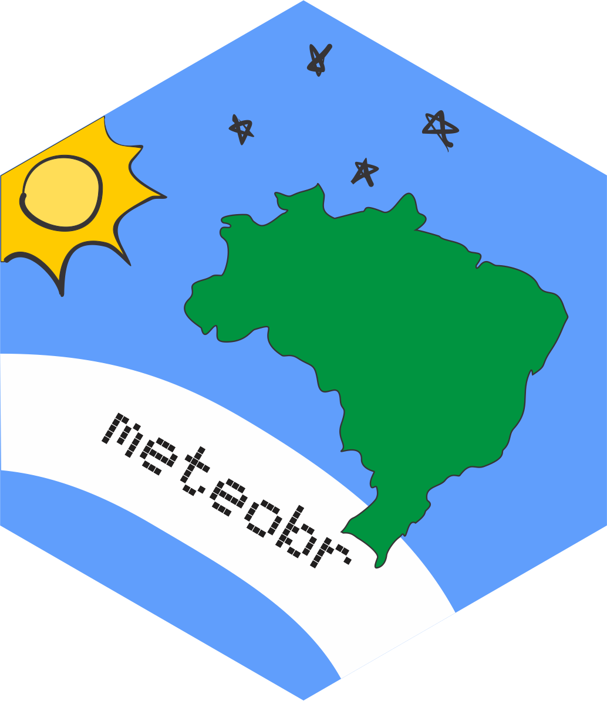

# meteobr <a href="https://github.com/carlosdemoura/meteobr"></a>

<!-- badges: start -->
<!-- badges: end -->

The goal of `meteobr` is to provide an easy way to get data from the automated meteorological stations of Brazil's [National Institute of Meteorology](https://pt.wikipedia.org/wiki/Instituto_Nacional_de_Meteorologia). These stations provide, at each hour of every day between 2000-2024, a plethora of useful data (see below).

It's worth mentioning


| column name            | Original name                                          |
|------------------------|--------------------------------------------------------|
| `precipitation`        | PRECIPITAÇÃO TOTAL, HORÁRIO (mm)                       |
| `atm_pressure`         | PRESSAO ATMOSFERICA AO NIVEL DA ESTACAO, HORARIA (mB)  |
| `atm_pressure_max`     | PRESSÃO ATMOSFERICA MAX.NA HORA ANT. (AUT) (mB)        |
| `atm_pressure_min`     | PRESSÃO ATMOSFERICA MIN. NA HORA ANT. (AUT) (mB)       |
| `radiation`            | RADIACAO GLOBAL (Kj/m²)                                |
| `temperature_air`      | TEMPERATURA DO AR - BULBO SECO, HORARIA (°C)           |
| `temperature_dew`      | TEMPERATURA DO PONTO DE ORVALHO (°C)                   |
| `temperature_max`      | TEMPERATURA MÁXIMA NA HORA ANT. (AUT) (°C)             |
| `temperature_min`      | TEMPERATURA MÍNIMA NA HORA ANT. (AUT) (°C)             |
| `temperature_dew_max`  | TEMPERATURA ORVALHO MAX. NA HORA ANT. (AUT) (°C)       |
| `temperature_dew_min`  | TEMPERATURA ORVALHO MIN. NA HORA ANT. (AUT) (°C)       |
| `humidity_max`         | UMIDADE REL. MAX. NA HORA ANT. (AUT) (%)               |
| `humidity_min`         | UMIDADE REL. MIN. NA HORA ANT. (AUT) (%)               |
| `humidity`             | UMIDADE RELATIVA DO AR, HORARIA (%)                    |
| `wind_direction`       | VENTO, DIREÇÃO HORARIA (gr) (° (gr))                   |
| `wind_burst_max`       | VENTO, RAJADA MAXIMA (m/s)                             |
| `wind_burst`           | VENTO, VELOCIDADE HORARIA (m/s)                        |


## Installation

You can install the development version of meteobr from [GitHub](https://github.com/carlosdemoura/meteobr/) with:

``` r
# install.packages("devtools")
devtools::install_github("carlosdemoura/UltimaFlorDoLacio")
```

## Example

This is a basic example which shows you how to solve a common problem:

``` r
library(meteobr)


```
